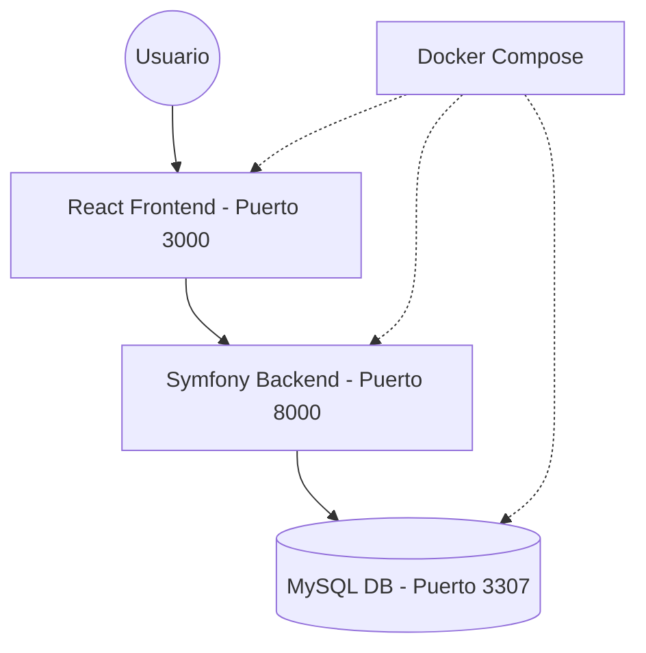

# Arquitectura del Sistema: Gestión de Pedidos

Este documento describe la arquitectura de alto nivel y las decisiones de diseño tomadas para el proyecto. El sistema sigue un enfoque de **Desacoplamiento Total** entre el cliente y el servidor, facilitando la escalabilidad y el mantenimiento independiente.

## 🏗️ Estructura General

El proyecto se organiza como un monorepositorio con tres componentes principales orquestados por Docker:

---

## 🖥️ Frontend (React + Vite)
- **Estado Global**: Se utiliza `React Context` para manejar la autenticación (`AuthContext`) y el carrito de compras (`CartContext`).
- **Persistencia**: Se emplea `localStorage` para mantener el estado del carrito y la sesión simulada entre recargas.
- **Seguridad Simulada**: Rutas protegidas (`ProtectedRoute`) que validan la existencia de un "token" y el rol del usuario antes de permitir el acceso a vistas sensibles como el Panel Admin.
- **Comunicación**: Centralizada en un cliente de `Axios` con interceptores que inyectan las cabeceras `X-Customer-Id` y `X-Role` en cada petición.

## ⚙️ Backend (Symfony 7)
- **Arquitectura de Servicios**: La lógica pesada (cálculo de impuestos, validación de stock, flujos de checkout) reside en servicios dedicados (`OrderService`, `CheckoutService`), manteniendo los controladores delgados.
- **API RESTful**: Sigue convenciones estándar de HTTP y provee respuestas en formato JSON consistente.
- **Base de Datos**: Modelado con Doctrine ORM utilizando 4 tablas principales: `products`, `orders`, `order_items` y `payments`.
- **CORS**: Configurado para permitir la comunicación segura entre dominios diferentes (puerto 3000 vs 8000) y exponer cabeceras personalizadas.

## 📦 Docker & Orquestación
- **Redes**: Todos los servicios conviven en una red privada virtual (`phptest_network`), permitiendo que el backend se comunique con la DB usando el nombre del servicio `db` en lugar de una IP.
- **Volúmenes**:
    - `db_data`: Persistencia real de los datos de MySQL.
    - `backend/`: Sincronización en tiempo real para desarrollo (Hot Reload de PHP).
- **Aislamiento**: Cada contenedor utiliza una imagen optimizada (Alpine para PHP/Nginx y MySQL 8 oficial).

---

## 🛠️ Decisiones de Diseño
1. **Simulación de Roles**: Se optó por una autenticación basada en cabeceras personalizadas para agilizar las pruebas del MVP sin la complejidad de JWT/OAuth en esta etapa.
2. **Cálculo de Impuestos**: Centralizado en el backend (15%) para asegurar que el "total" del pedido sea inmutable y calculado en el servidor.
3. **Persistencia Local**: El carrito se guarda en el navegador para evitar peticiones innecesarias al servidor hasta el momento final de la compra.
