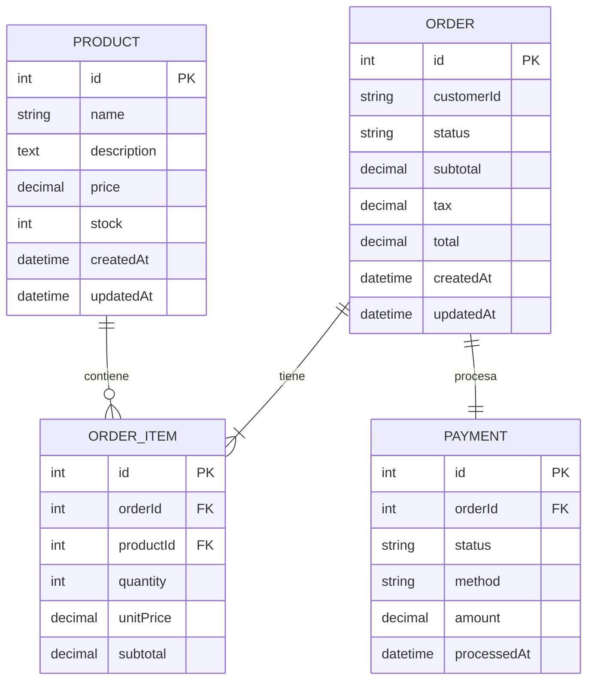

# Documentación del Modelo de Datos

## Resumen General

El sistema utiliza 4 entidades principales para gestionar el flujo de trabajo de pedidos y pagos:
- **Product (Producto)**: Artículos disponibles en el catálogo.
- **Order (Pedido)**: Pedidos realizados por los clientes.
- **OrderItem (Ítem de Pedido)**: Artículos individuales dentro de un pedido.
- **Payment (Pago)**: Registros de pago (simulados).

## Diagrama de Entidad-Relación



## Esquema de Tablas

### products (productos)

| Columna | Tipo | Restricciones | Descripción |
|--------|------|-------------|-------------|
| id | INT | PRIMARY KEY, AUTO_INCREMENT | Identificador único |
| name | VARCHAR(255) | NOT NULL | Nombre del producto |
| description | TEXT | NULLABLE | Descripción del producto |
| price | DECIMAL(10,2) | NOT NULL | Precio del producto |
| stock | INT | NOT NULL, >= 0 | Cantidad de stock disponible |
| createdAt | DATETIME | NOT NULL | Fecha de creación |
| updatedAt | DATETIME | NOT NULL | Fecha de última actualización |

**Índices:**
- PRIMARY KEY (id)
- INDEX (name) - para consultas de búsqueda

### orders (pedidos)

| Columna | Tipo | Restricciones | Descripción |
|--------|------|-------------|-------------|
| id | INT | PRIMARY KEY, AUTO_INCREMENT | Identificador único |
| customerId | VARCHAR(100) | NOT NULL | Identificador del cliente |
| status | VARCHAR(20) | NOT NULL | Estado (pending/processing/completed/cancelled) |
| subtotal | DECIMAL(10,2) | NOT NULL | Subtotal del pedido |
| tax | DECIMAL(10,2) | NOT NULL | Impuestos (15%) |
| total | DECIMAL(10,2) | NOT NULL | Monto total |
| createdAt | DATETIME | NOT NULL | Fecha de creación |
| updatedAt | DATETIME | NOT NULL | Fecha de última actualización |

**Índices:**
- PRIMARY KEY (id)
- INDEX (customerId) - para consultas de pedidos por cliente
- INDEX (status) - para filtrado por estado

### order_items (ítems de pedido)

| Columna | Tipo | Restricciones | Descripción |
|--------|------|-------------|-------------|
| id | INT | PRIMARY KEY, AUTO_INCREMENT | Identificador único |
| orderId | INT | NOT NULL, FOREIGN KEY | Referencia al pedido |
| productId | INT | NOT NULL, FOREIGN KEY | Referencia al producto |
| quantity | INT | NOT NULL, > 0 | Cantidad pedida |
| unitPrice | DECIMAL(10,2) | NOT NULL | Precio unitario al momento del pedido |
| subtotal | DECIMAL(10,2) | NOT NULL | Subtotal del ítem (cantidad * unitPrice) |

**Claves Foráneas:**
- orderId REFERENCES orders(id) ON DELETE CASCADE
- productId REFERENCES products(id)

### payments (pagos)

| Columna | Tipo | Restricciones | Descripción |
|--------|------|-------------|-------------|
| id | INT | PRIMARY KEY, AUTO_INCREMENT | Identificador único |
| orderId | INT | NOT NULL, UNIQUE, FOREIGN KEY | Referencia al pedido |
| status | VARCHAR(20) | NOT NULL | Estado del pago (pending/completed/failed) |
| method | VARCHAR(50) | NOT NULL | Método de pago (simulado) |
| amount | DECIMAL(10,2) | NOT NULL | Monto del pago |
| processedAt | DATETIME | NULLABLE | Fecha de procesamiento |

---

## Reglas de Negocio

### Producto
1. **Validación de Precio**: Debe ser mayor a 0.
2. **Gestión de Stock**: No puede ser negativo.
3. **Reducción de Stock**: Se descuenta automáticamente al crear un pedido.

### Pedido
1. **Flujo de Estados**: pending → processing → completed (o cancelled).
2. **Cálculo de Impuestos**: Tasa fija del 15% sobre el subtotal.
3. **Propiedad**: Los clientes solo pueden acceder a sus propios pedidos.

### Ítem de Pedido
1. **Validación de Cantidad**: Debe ser mayor a 0.
2. **Snapshot de Precio**: Se captura el precio unitario en el momento de la creación.

---

## Estrategia de Migración

Las migraciones se gestionan con Doctrine Migrations:

```bash
# Ejecutar migraciones
php bin/console doctrine:migrations:migrate
```

## Datos de Ejemplo

Carga de productos iniciales:
```bash
php bin/console doctrine:fixtures:load
```
